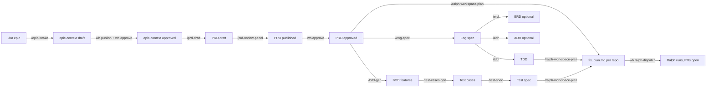



## TL;DR — Stop Reading, Run This

```zsh
wb.wtd
```

`wb.wtd` (What-To-Do) reads `.workbench-state/`, walks the per-epic pipeline, and prints the single next command to run. It is the answer to "I don't know what step I'm on." The rest of this page is the manual edition of the same logic — for when you want to learn the pipeline, not just clear it.

See the [`/wtd` skill reference](./skills/wtd.html) for the underlying recommendation logic.

---

## The Pipeline, End to End



Every box is either `draft`, `published`, or `approved`. Ralph only consumes what is in `.workbench-state/approved.json`. Everything else is invisible to ralph.

See [Artifact Lifecycle](./lifecycle.html) for the state machine that backs every box.

---

## If You Are Here, Do This Next

### Stage 0 — Empty Workbench

| You see | Do this |
|---------|---------|
| You just ran `init.wb` or `join.wb` and you have never opened the workbench. | Open Claude or Devin in this directory, then run `/pmo-status` to confirm orientation, and `wb.wtd` to get your first command. |
| `project.conf` `EPICS=(...)` is empty. | Edit `project.conf`, append the Jira epic IDs in scope, commit, push. |
| No `.workbench-state/approved.json` yet. | Run any `wb.publish` once — it auto-creates the ledger files. |

### Stage 1 — Epic Intake

| You see | Do this |
|---------|---------|
| Epic is in `project.conf` but `product/context-library/epics/<EPIC>.md` does not exist. | `/epic-intake <EPIC>` |
| `product/context-library/epics/<EPIC>.md` exists at `status: draft`. | Review it. Then publish + approve: `wb.publish epic-<EPIC> product/context-library/epics/<EPIC>.md epic-context && wb.approve epic-<EPIC>` |
| `epic-<EPIC>` is in `published.json` but not `approved.json`. | Counterpart should approve: `wb.approve epic-<EPIC>` |

### Stage 2 — PRD Drafting

| You see | Do this |
|---------|---------|
| Epic context is approved, no PRD exists. | `/prd-draft <EPIC>` |
| PRD draft exists but has not been reviewed. | `/prd-review-panel <PRD_ID>` to run the 7-perspective review. |
| Review found P0 findings. | Address the P0s in the PRD body. Re-run review. P0s must clear before publish. |
| Review clean. | `wb.publish <PRD_ID> product/outputs/prds/<file>.md prd` then `wb.approve <PRD_ID>` (after counterpart sign-off). |
| One epic, multiple PRDs. | Approve in priority order from `EPIC-PIPELINE.md` "Queued PRDs" table. |

### Stage 3 — Design (Optional, UX hat)

| You see | Do this |
|---------|---------|
| PRD approved, no Figma refs collected. | `/figma-pull <PRD_ID> <FIGMA_URL>` |
| Figma refs parked, no screens generated. | `/ds-screen-gen <PRD_ID>` |
| Screens generated, no design review yet. | `/design-review <PRD_ID>` |
| Want the whole UX flow in one shot. | `/design-draft <PRD_ID>` orchestrates `figma-pull` → `ds-screen-gen` → `design-review`. |

### Stage 4 — Engineering (Dev hat)

| You see | Do this |
|---------|---------|
| PRD approved, no engineering spec. | `/eng-spec <PRD_ID>` |
| Eng spec at `status: draft`. | Run `/grill-me` or `/domain-grill` on it, then `wb.publish <SPEC_ID> engineering/outputs/specs/<file>.md eng-spec`. |
| Eng spec approved, no TDD. | `/tdd <SPEC_ID>` |
| Touching a service repo and the data model is non-trivial. | `/erd <SPEC_ID>` for the ER + C4 diagram set. |
| Making a hard-to-reverse decision (database, framework, auth model). | `/adr <SPEC_ID>` — MADR-lite ADR. May stand alone without a SPEC for cross-cutting calls. |
| Eng spec rejected. | Read the reason in `.workbench-state/rejected.json`, fix the spec, re-publish. |

### Stage 5 — QA (QA hat)

| You see | Do this |
|---------|---------|
| PRD approved, no BDD features. | `/bdd-gen <PRD_ID>` |
| BDDs approved, no test cases. | `/test-cases-gen <PRD_ID>` |
| Test cases approved, no test spec. | `/test-spec <PRD_ID>` |
| Test spec needs the ERD too. | `/test-spec` chains an optional TERD pass — accept it when the data model is non-trivial. |

### Stage 6 — Ralph Plan + Dispatch (Orchestrator hat)

| You see | Do this |
|---------|---------|
| PRD + eng spec + TDD + test spec all approved, no `repos/.ralph/fix_plan.md`. | `wb.ralph-enable-check` (preflight), then `/ralph-workspace-plan`. |
| `fix_plan.md` exists per repo, ready to run. | `wb.ralph-dispatch` |
| Only want one repo to run. | `wb.ralph-dispatch --repos <name>` |
| Want to skip one repo. | `wb.ralph-dispatch --exclude <name>` |
| Stakeholder changed one repo's PRD slice. | `wb.ralph-plan --replan <repo>` (regenerates only that section, splices back in). |
| Want plan workers in parallel (workspace mode). | `wb.ralph-plan --parallel-plan N` |
| Need to debug one repo's ralph loop interactively. | `(cd "$WB_ROOT/repos/<name>" && ralph --live --monitor)` |
| Dispatch already running. | `wb.ralph-dispatch --status` to see open PRs + tail worker logs. |

### Stage 7 — Recovery Paths

| You see | Do this |
|---------|---------|
| Artifact approved by mistake. | `wb.reject <ID> "<reason>"` returns it to `draft`. Records reason in `.workbench-state/rejected.json`. |
| Artifact rejected and you have addressed the reason. | Edit the file, `wb.publish` again, then `wb.approve`. |
| `wb.publish` complains about a missing `target_repos:` field. | Open the artifact, add `target_repos: [<repo-name>, ...]` to YAML frontmatter (or `# target_repos:` to a `.feature` file), retry. |
| `wb.publish` warns about no `grilled:` block. | Run the host skill's grill step (e.g. `/grill-me`, `/domain-grill`) and re-publish. Warnings do not block publish. |
| Ralph PR has a footer of `steering.local/` overrides you do not recognise. | Run `wb.steering-audit` to see which template rules a teammate overrode, when, and by whom. |
| `update.wb` overwrote a file you customised. | Move team-specific guidance to `steering.local/` (user-owned). Template paths (`skills/`, `scripts/`, `CLAUDE.md`, `AGENTS.md`, `aliases.sh`) are rewritten on every `wb.upgrade`. |
| Engine clone is out of date. | `devkit.upgrade` (ai-devkit), `ralph.upgrade` (ai-ralph), `wb.upgrade` (this stamped wb). One-step: `devkit doctor`. |

---

## Decision Cheatsheet by Role

### PO Hat

```
new epic → /epic-intake → approve → /prd-draft → /prd-review-panel → publish + approve
```

### Dev Hat

```
PRD approved → /eng-spec → grill → publish + approve → /tdd → (optional /erd, /adr) → done
```

### QA Hat

```
PRD approved → /bdd-gen → publish + approve → /test-cases-gen → publish + approve → /test-spec → publish + approve
```

### UX Hat

```
PRD approved → /design-draft  (or piecewise: /figma-pull → /ds-screen-gen → /design-review)
```

### Orchestrator Hat

```
all PRD-scoped artifacts approved → wb.ralph-enable-check → /ralph-workspace-plan → wb.ralph-dispatch
```

---

## Common "But What About…" Cases

**Cross-cutting work that does not belong to one epic.**
Use an ADR (`/adr` without a SPEC ID) for the decision. File the implementation under the most relevant existing PRD's eng-spec, or open a tiny scoped PRD for it.

**Two epics share a single PRD.**
Put both epic IDs in the PRD's `epic_id:` frontmatter as a YAML list. `/wtd` will recognise the PRD against both epics.

**You inherited a workbench mid-stream and the lifecycle drifted.**
Run `wb.wtd --json` and pipe through `jq '.recommendations[]'`. Address blockers first (priority < 30). When the recommender goes silent on an epic, that epic is unblocked.

**One repo's tests fail repeatedly under ralph.**
`(cd "$WB_ROOT/repos/<name>" && ralph --live --monitor)` to attach a live monitor. Fix the failing test in the workbench's TDD or test-spec, re-publish, re-approve, then re-dispatch only that repo via `wb.ralph-dispatch --repos <name>`.

**Counterpart approved something while you were drafting it.**
`git pull --rebase` is the first command every session for a reason. The shared workbench is not concurrency-safe across machines.

---

## See Also

- [/wtd skill](./skills/wtd.html) — recommendation engine that powers `wb.wtd`.
- [/pmo-status skill](./skills/pmo-status.html) — full rollup when you want the whole board, not just the next step.
- [Artifact Lifecycle](./lifecycle.html) — three stages, three ledgers, one ralph gate.
- [Ralph Integration](./ralph.html) — workspace plan, dispatch, parallel modes.
- [Skills reference](./skills.html) — every skill, every input gate.
