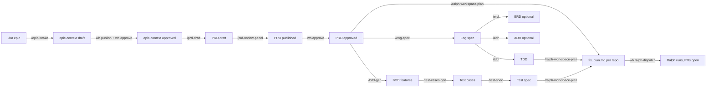



## TL;DR

```zsh
wb.wtd
```

Reads `.workbench-state/`, walks per-epic pipeline, prints the single next command. The rest of this page is the manual version, for when you want to learn the pipeline rather than just clear it. Logic ref: [/wtd skill](./skills/wtd.html).

---

## Pipeline



Every box is `draft`, `published`, or `approved`. Ralph only consumes `.workbench-state/approved.json`. Everything else is invisible to ralph. State machine: [Artifact Lifecycle](./lifecycle.html).

---

## If you are here, do this next

### Stage 0: Empty workbench

| You see | Do this |
|---------|---------|
| Just ran `init.wb` / `join.wb`, never opened the wb. | Open Claude or Devin in this dir; run `/pmo-status` for orientation, then `wb.wtd` for the first command. |
| `project.conf` `EPICS=(...)` empty. | Append Jira epic IDs, commit, push. |
| No `.workbench-state/approved.json` yet. | Any `wb.publish` auto-creates the ledger files. |

### Stage 1: Epic intake

| You see | Do this |
|---------|---------|
| Epic in `project.conf` but `product/context-library/epics/<EPIC>.md` missing. | `/epic-intake <EPIC>` |
| `epics/<EPIC>.md` at `draft`. | Review, then `wb.publish epic-<EPIC> product/context-library/epics/<EPIC>.md epic-context && wb.approve epic-<EPIC>` |
| `epic-<EPIC>` in `published.json` but not `approved.json`. | Counterpart approves: `wb.approve epic-<EPIC>` |

### Stage 2: PRD drafting

| You see | Do this |
|---------|---------|
| Epic context approved, no PRD. | `/prd-draft <EPIC>` |
| PRD draft, not reviewed. | `/prd-review-panel <PRD_ID>` (7-perspective review). |
| Review found P0s. | Address P0s. Re-run review. P0s must clear before publish. |
| Review clean. | `wb.publish <PRD_ID> product/outputs/prds/<file>.md prd` then `wb.approve <PRD_ID>` (after counterpart sign-off). |
| One epic, multiple PRDs. | Approve in priority order from `EPIC-PIPELINE.md` "Queued PRDs". |

### Stage 3: Design (optional, UX hat)

| You see | Do this |
|---------|---------|
| PRD approved, no Figma refs. | `/figma-pull <PRD_ID> <FIGMA_URL>` |
| Figma refs parked, no screens. | `/ds-screen-gen <PRD_ID>` |
| Screens generated, no review. | `/design-review <PRD_ID>` |
| Want the whole UX flow at once. | `/design-draft <PRD_ID>` (orchestrates figma-pull → ds-screen-gen → design-review). |

### Stage 4: Engineering (dev hat)

| You see | Do this |
|---------|---------|
| PRD approved, no eng spec. | `/eng-spec <PRD_ID>` |
| Eng spec at `draft`. | `/grill-me` or `/domain-grill`, then `wb.publish <SPEC_ID> engineering/outputs/specs/<file>.md eng-spec`. |
| Eng spec approved, no TDD. | `/tdd <SPEC_ID>` |
| Service repo + non-trivial data model. | `/erd <SPEC_ID>` (ER + C4). |
| Hard-to-reverse decision (DB, framework, auth). | `/adr <SPEC_ID>` (MADR-lite). May stand alone without a SPEC for cross-cutting calls. |
| Eng spec rejected. | Read reason in `rejected.json`, fix, re-publish. |

### Stage 5: QA (QA hat)

| You see | Do this |
|---------|---------|
| PRD approved, no BDDs. | `/bdd-gen <PRD_ID>` |
| BDDs approved, no test cases. | `/test-cases-gen <PRD_ID>` |
| Test cases approved, no test spec. | `/test-spec <PRD_ID>` |
| Test spec needs the ERD too. | `/test-spec` chains an optional TERD pass; accept when the data model is non-trivial. |

### Stage 6: Ralph plan + dispatch (orchestrator hat)

| You see | Do this |
|---------|---------|
| PRD + eng-spec + TDD + test-spec all approved, no `repos/.ralph/fix_plan.md`. | `wb.ralph-enable-check`, then `/ralph-workspace-plan`. |
| `fix_plan.md` exists per repo, ready to run. | `wb.ralph-dispatch` |
| Only one repo. | `wb.ralph-dispatch --repos <name>` |
| Skip a repo. | `wb.ralph-dispatch --exclude <name>` |
| One repo's PRD slice changed. | `wb.ralph-plan --replan <repo>` (regen that section, splice back). |
| Workspace-mode parallel planning. | `wb.ralph-plan --parallel-plan N` |
| Long unattended run. | `wb.ralph-dispatch --parallel N --max-tasks M` (continuous mode). |
| Debug one repo's loop. | `(cd "$WB_ROOT/repos/<name>" && ralph --live --monitor)` |
| Dispatch already running. | `wb.ralph-dispatch --status` (open PRs + worker log tails). |

### Stage 7: Recovery

| You see | Do this |
|---------|---------|
| Artifact approved by mistake. | `wb.reject <ID> "<reason>"` (back to `draft`; reason logged in `rejected.json`). |
| Rejected artifact, fixed. | Edit file, `wb.publish` again, `wb.approve`. |
| `wb.publish` complains about missing `target_repos:`. | Add `target_repos: [<repo-name>, ...]` to YAML frontmatter (or `# target_repos:` in a `.feature`), retry. |
| `wb.publish` warns about no `grilled:` block. | Run the host's grill step (`/grill-me`, `/domain-grill`), re-publish. Warnings do not block publish. |
| Ralph PR footer lists unfamiliar `steering.local/` overrides. | `wb.steering-audit` (who overrode what, when). |
| `wb.upgrade` overwrote a file you customised. | Move team-specific rules to `steering.local/` (user-owned). Template paths (`skills/`, `scripts/`, `CLAUDE.md`, `AGENTS.md`, `aliases.sh`) rewrite on every upgrade. |
| Engine clone stale. | `devkit.upgrade`, `ralph.upgrade`, `wb.upgrade`. One-shot: `devkit doctor`. |

---

## Per-hat cheatsheet

**PO**
```
new epic → /epic-intake → approve → /prd-draft → /prd-review-panel → publish + approve
```

**Dev**
```
PRD approved → /eng-spec → grill → publish + approve → /tdd → (optional /erd, /adr)
```

**QA**
```
PRD approved → /bdd-gen → publish + approve → /test-cases-gen → publish + approve → /test-spec → publish + approve
```

**UX**
```
PRD approved → /design-draft   (or: /figma-pull → /ds-screen-gen → /design-review)
```

**Orchestrator**
```
all PRD-scoped artifacts approved → wb.ralph-enable-check → /ralph-workspace-plan → wb.ralph-dispatch
```

---

## But what about

**Cross-cutting work, not one epic.**
Use `/adr` (without a SPEC ID) for the decision. File implementation under the closest existing PRD's eng-spec, or open a tiny scoped PRD.

**Two epics, one PRD.**
List both IDs in `epic_id:` frontmatter (YAML list). `/wtd` recognises the PRD against both.

**Inherited a wb mid-stream, lifecycle drifted.**
`wb.wtd --json | jq '.recommendations[]'`. Address blockers first (priority < 30). Silence on an epic means unblocked.

**One repo's tests fail repeatedly under ralph.**
`(cd "$WB_ROOT/repos/<name>" && ralph --live --monitor)`. Fix the test in the wb's TDD or test-spec, re-publish, re-approve, re-dispatch only that repo via `wb.ralph-dispatch --repos <name>`.

**Counterpart approved something while you were drafting.**
`git pull --rebase` is the first command every session for a reason. Shared wb is not concurrency-safe across machines.

---

## See also

- [/wtd skill](./skills/wtd.html): recommender behind `wb.wtd`.
- [/pmo-status skill](./skills/pmo-status.html): full board rollup.
- [Artifact lifecycle](./lifecycle.html): three stages, three ledgers, one ralph gate.
- [Ralph integration](./ralph.html): workspace plan, dispatch, parallel + continuous modes.
- [Skills reference](./skills.html): every skill, every input gate.
